<h1 align='center'>FLYSTORE</h1>

- An Ecommerce website designed in HTML, CSS, JS, Bootstrap and PHP.

## About the Website

- “FLYSTORE” is an ecommerce website platform for various products from different categories such as Clothing, Food, Footwear, Electronics, Home-appliances, Mobiles, Grocery, Cosmetics etc. Website displays all the lists of products with their respective prices. There are two categories for login on this website: Admin and Customer.In an overview of this web application, the customer has to register in order to perform various actions. A customer can look for products, add products to the cart, add products to a wishlist. Each product contains its own description, features, and number of photos. Talking about the checkout procedure, as soon as the customer passes through checkout procedures, the he/she has to manage the order from the account section.
- <b>Languages and Technologies used: PHP, HTML, CSS, JS/Bootstrap & MySQL
- <b>Author Name :</b> Anuj Jain, Prashant Singh Chauhan, Neha Singh, Pradumn Kumar & Vimal Vinayak

- <b>Login Details : </b> 
  - After you finish downloading the project, unzip the project file and head over to your XAMPP directory.
  - There you’ll find a folder naming “htdocs”.
  - Inside the “htdocs” folder, paste the project folder (not the .zip one, but the extracted one).
  - Open your favorite browser; we recommend using Google Chrome or Brave.
  - Then, go to URL “http://localhost/phpmyadmin“.
  - Click on New to create a new database named “dbms_flystore”.
  - Click on the “Import” tab and choose then on “Choose file”.
  - Now choose the "database file.sql"  and then click on go.
  - After setting up all these, go to URL http://localhost/[PROJECT_FOLDER_NAME ]/
  - You will see index page then click admin or user and register your account and then you will be directed to the login page where you can use the register credentials to login.

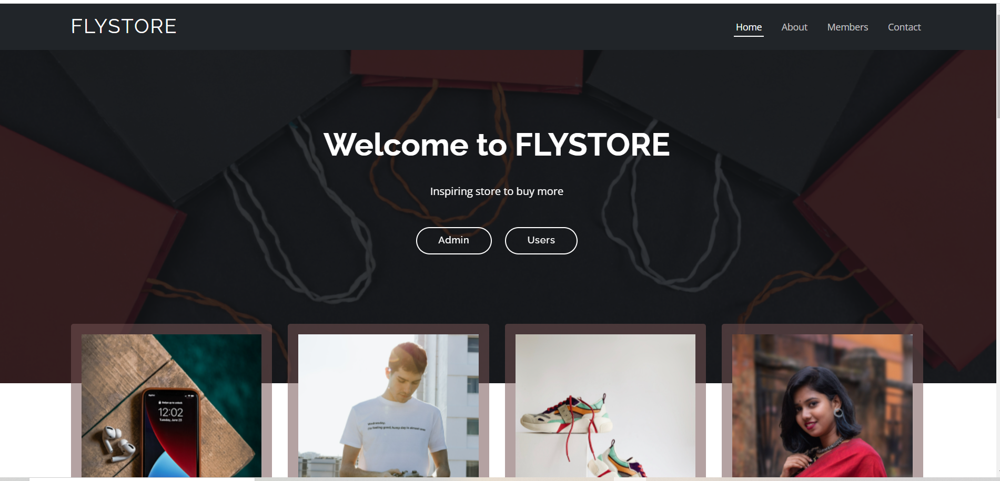
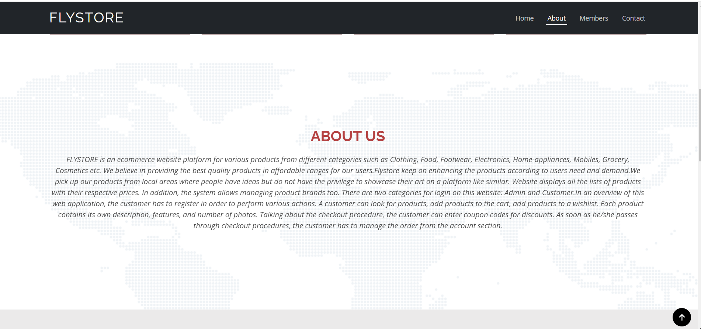
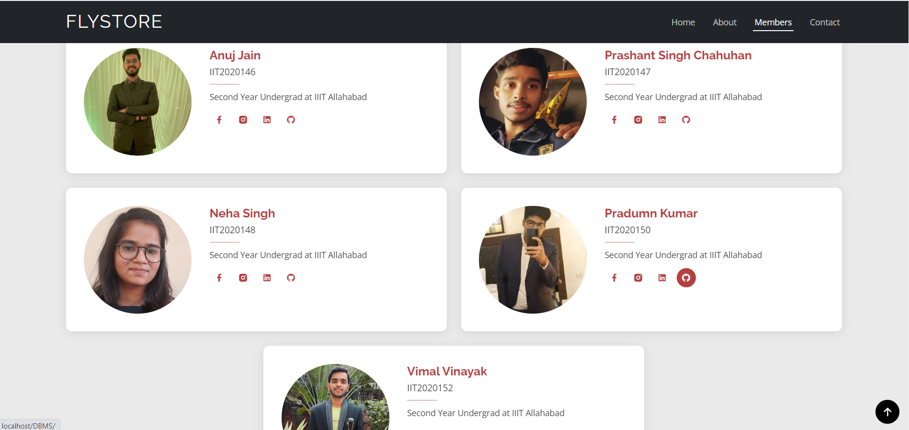
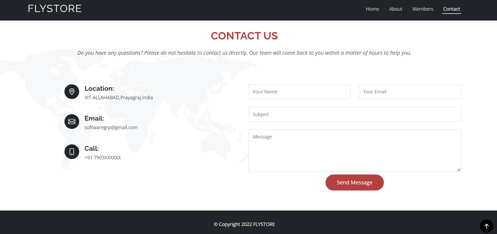
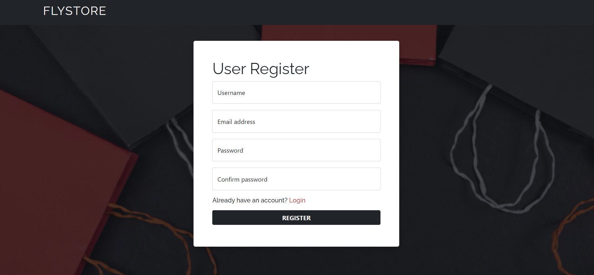
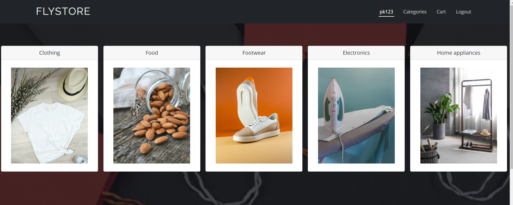
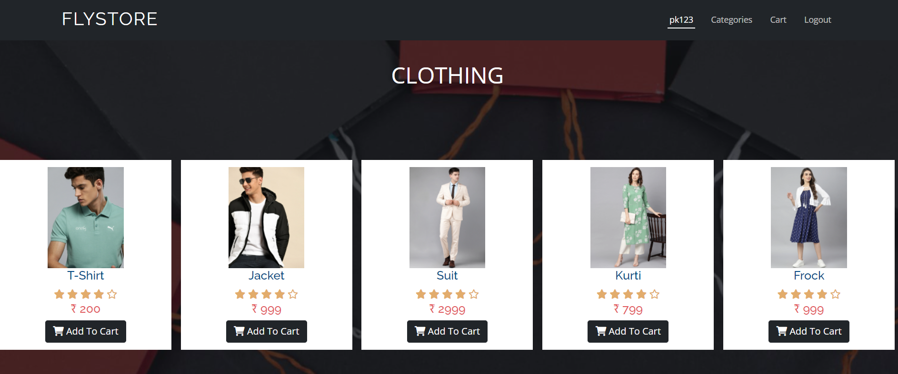
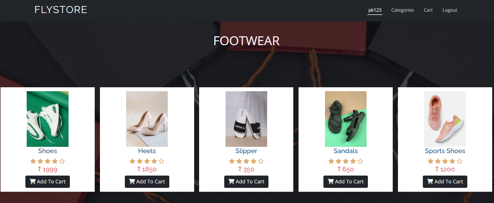
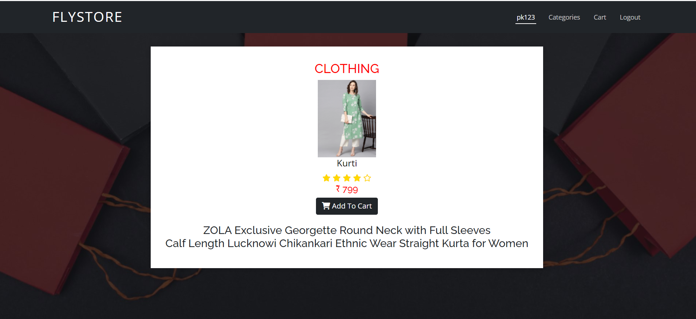
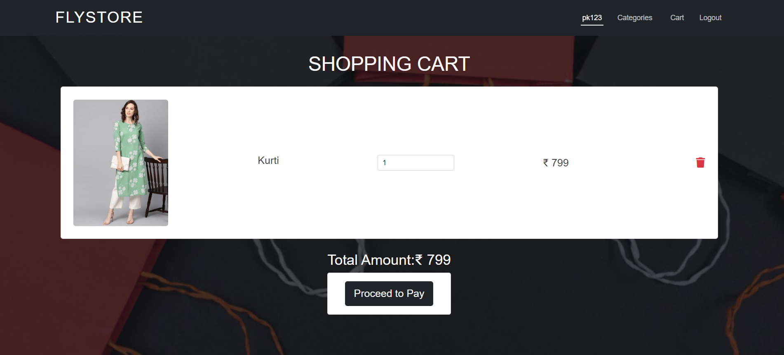
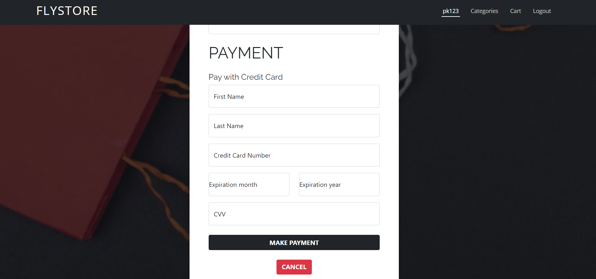
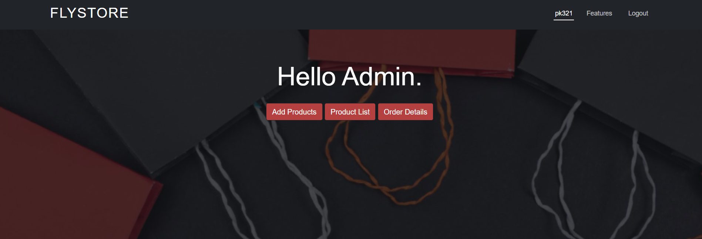
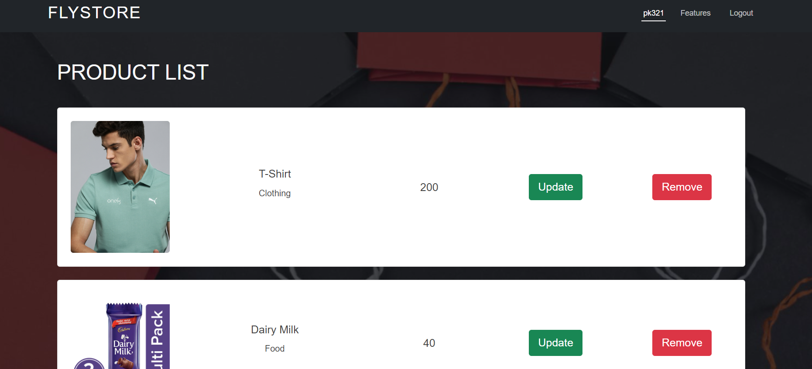
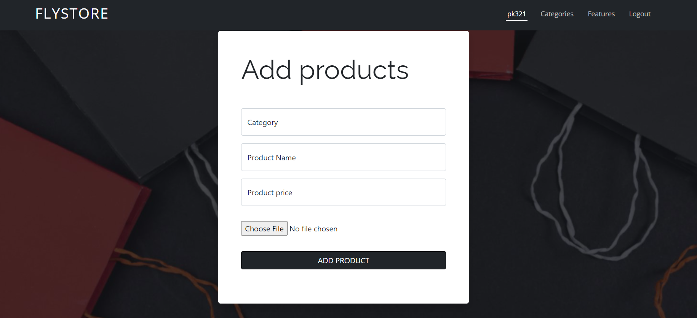
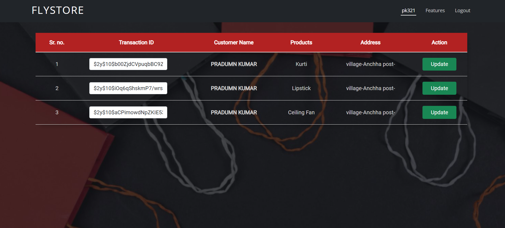
